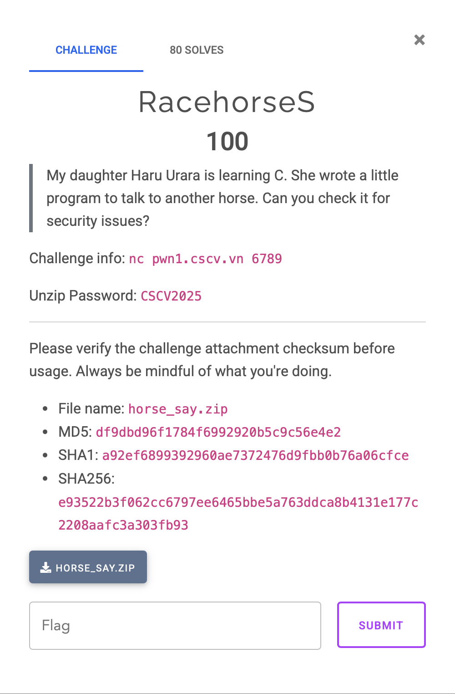
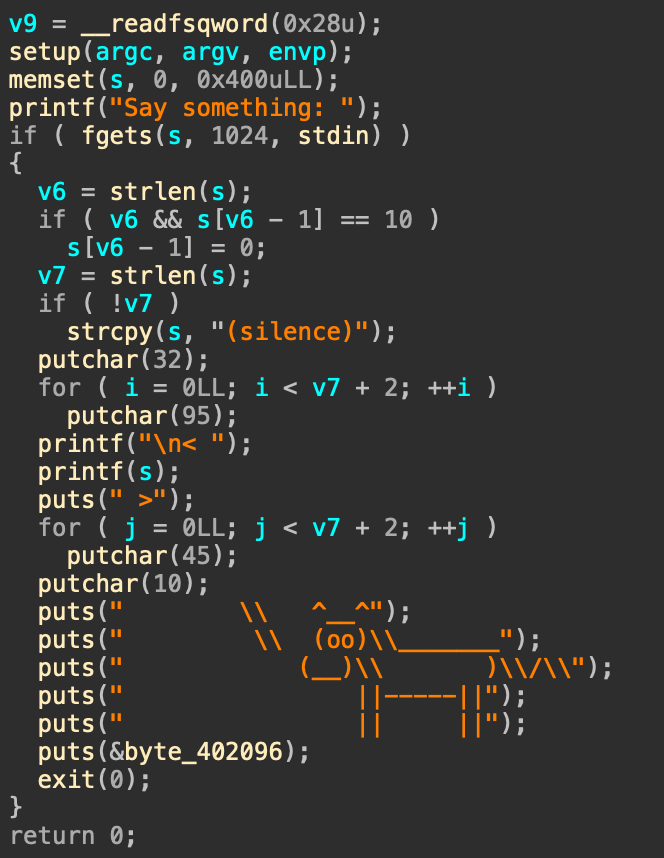
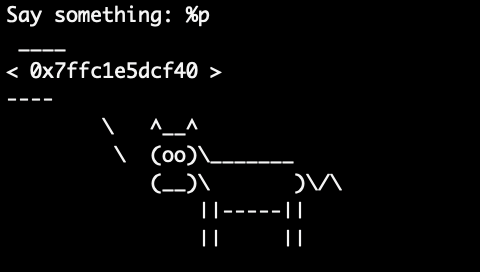
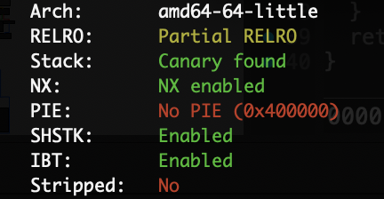

~ RacehorseS ~

# Đề bài

# Phân tích Challenge
Dễ thấy challenge bị lỗi format string "printf(s)" ở dòng 26

Kiểm tra security, ta thấy Partial RELRO 

# Hướng giải:
- Ghi đè exit got -> main
- Leak libc
- Ghi đè printf got -> system
- Thực thi prtinf "/bin/sh" -> get shell

+ [script](solve.py)
+ Flag: CSCV2025{k1m1_n0_4184_64_2ukyun_d0kyun_h45h1r1d35h1}
