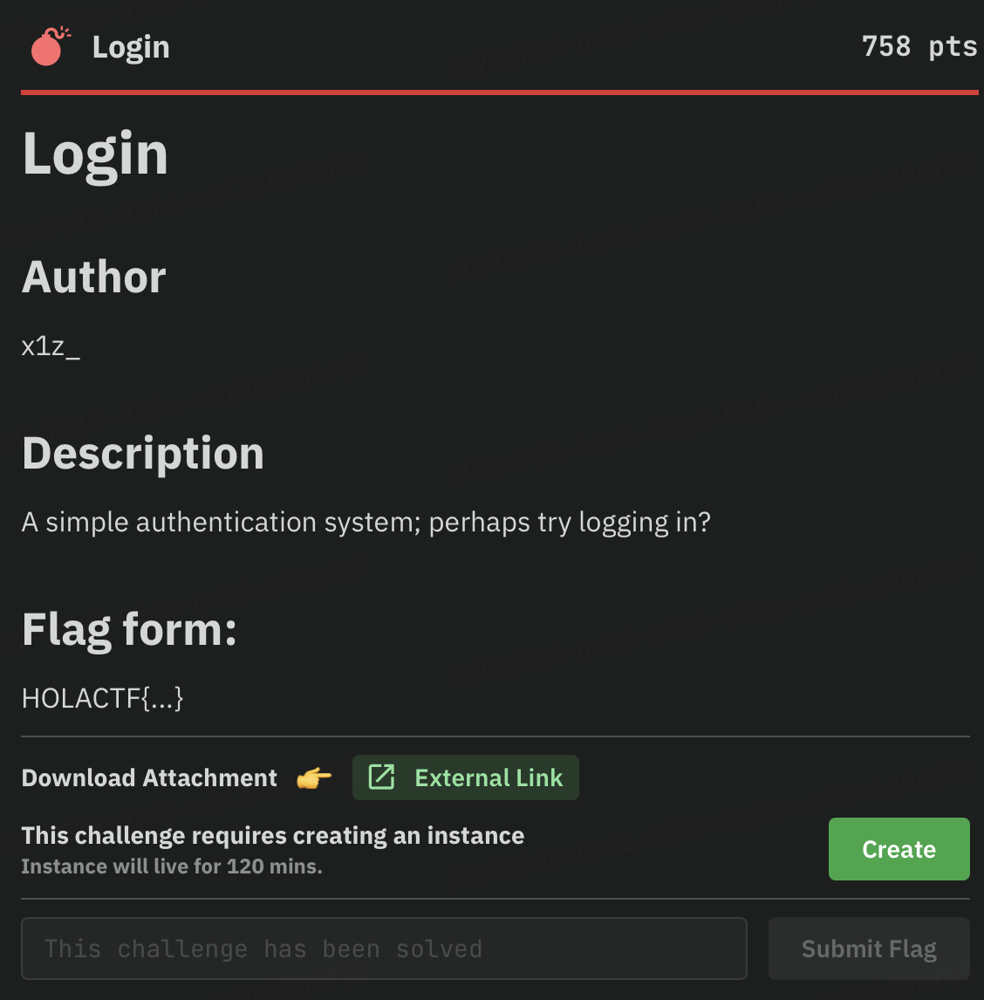
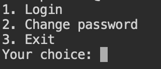
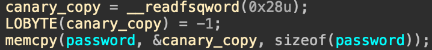
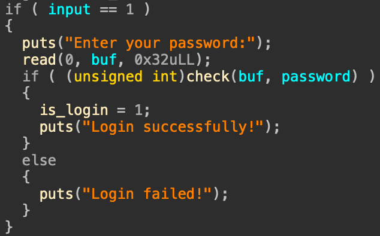
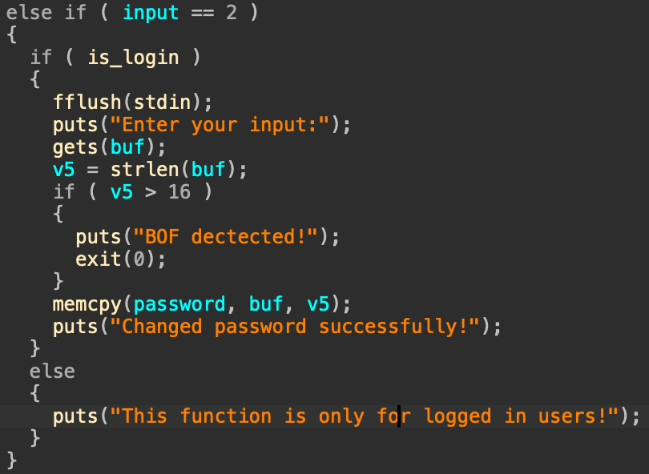
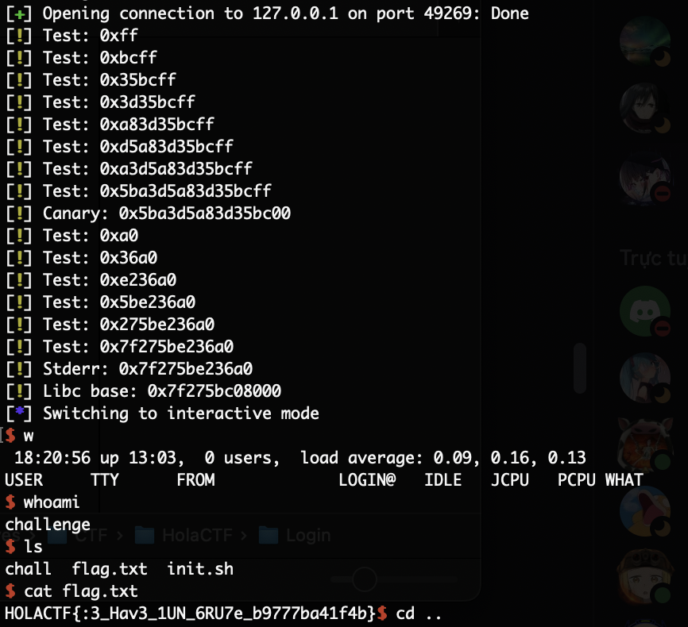

# CTF WU - LOGIN

- **Chall:** [chall](./chall)
- **Expoit:** [solve](./solve.py)

## Phân tích
- Chạy thử challenge, ta sẽ thấy 3 options và nếu muốn change password, bắt buộc phải Login thành công.

- Decompile ta thấy password được lấy từ canary + 0xFF, nên ta nghĩ ngay đến brute-force.

- Sau khi vượt qua login, ta thấy ngay unlimited overflow ở hàm gets, ta sẽ bypass check length input bằng cách gửi '\x00' trong Payload. 

- Tiếp đó, ta sẽ leak libc bằng cách stack pivot và trỏ địa chỉ brute đến stderr.

- Khi đã có libc, ta tiếp tục dùng gets gọi system /bin/sh và có được shell :>

## Flag
    HOLACTF{:3_Hav3_1UN_6RU7e_b9777ba41f4b}
